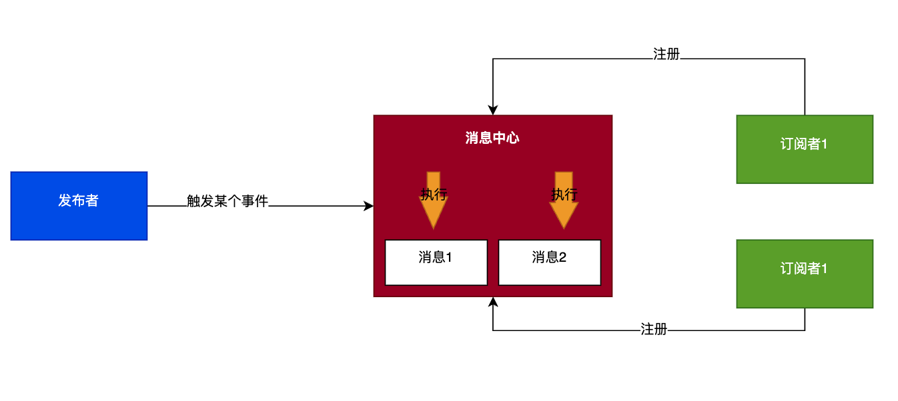

# 前言

EventBus作为发布订阅设计模式的经典应用场景，很值得我们去学习研究它的实现原理。

手写难度：⭐️⭐️

<!-- more -->

可以直接去看完整源码地址（记得给个star），地址如下：

[https://github.com/qiubohong/hundred-interview-questions/tree/main/3-event-bus](https://github.com/qiubohong/hundred-interview-questions/tree/main/3-event-bus)

# EventBus

## 是什么

EventBus其实是一个技术概念，主要是通过事件订阅方式解决不同情况下消息通讯问题，不仅仅在前端，还在Native（Android）等各个地方都有在使用。

EventBus 可以分成下面四个部分：

- 订阅者 Subscriber： 监听某类事件，当发布者触发该类事件后执行所需要的事件。
- 发布者 Publisher：当满足某些条件，发布触发订阅者的事件。
- 消息 Event：其实就需要传递的消息或事件本身。
- 消息中心 EventStore: 负责存储消息与订阅者的对应关系，有消息触发时，负责通知订阅者。

几者的关系如下图所示：



## 应用场景

上面是讲了一些概念性，但是在实际开发中，EventBus其实已经很多地方在使用了，如：

- Vue2中的`$emit` `$on`其实就是利用EventBus实现的，同时还可以使用去实现跨组件实现通讯
- Node.js中的的`EventEmitter`，支持`on` `emit`，可以利用其解决`回调地狱`问题

## 实现

EventBus主要有几个方法：

- `on(event, func)` 为指定事件注册一个监听器，接受一个字符串 event 和一个回调函数。
- `emit(event, ...args)` 按监听器的顺序执行执行每个监听器，如果事件有注册监听返回 true，否则返回 false。
- `once(event, func)` 为指定事件注册一个单次监听器，即 监听器最多只会触发一次，触发后立刻解除该监听器。
- `off(event, func)` 移除指定事件的某个监听器，监听器必须是该事件已经注册过的监听器。
- `offAll(event)` 移除所有事件的所有监听器

下面是实现代码:

```js
class EventBus {
    constructor() {
        // 消息队列 存储事件和回调
        this.listeners = {};
    }
    /**
     * 订阅事件
     * @param {*} event 
     * @param {*} callback 
     */
    on(event, callback) {
        if (!this.listeners[event]) {
            this.listeners[event] = [];
        }
        this.listeners[event].push(callback);
    }

    /**
     * 注销事件
     * @param {*} event 
     * @param {*} callback 
     * @returns 
     */
    off(event, callback) {
        if (!this.listeners[event]) {
            return;
        }
        this.listeners[event] = this.listeners[event].filter(listener => listener !== callback);
    }

    /**
     * 发布触发事件
     * @param {*} event 
     * @param  {...any} args 
     * @returns 
     */
    emit(event, ...args) {
        if (!this.listeners[event]) {
            return;
        }
        this.listeners[event].forEach(listener => listener(...args));
    }

    /**
     * 只触发一次的事件
     * @param {*} event 
     * @param {*} callback 
     */
    once(event, callback) {
        if(!this.listeners[event]) {
            this.listeners[event] = [];
        }
        const onceCallback = (...args) => {
            callback(...args);
            this.off(event, onceCallback);
        }
        this.listeners[event].push(onceCallback);
    }

    /**
     * 注销某个事件的所有回调
     * @param {*} event 
     * @returns 
     */
    offAll(event) {
        if (!this.listeners[event]) {
            return;
        }
        this.listeners[event] = [];
    }
}

;(function() {
    const eventBus = new EventBus();
    eventBus.on('test', (a, b) => {
        console.log(a, b);
    });
    setTimeout(() => {
        eventBus.emit('test', 1, 2);
    });
})()
```

EventBus模式使用上需要注意的问题：

- 如果`on`注册多次，可能会导致一次`emit`就会执行多次函数，导致无法定位到哪里注册多，因此使用的时候，需要考虑什么时候把事件`off`
- `off`需要明确指出函数对象，所以我们的注册函数建议都通过声明函数去实现，而不是匿名函数，减少注销事件的麻烦
- `on`注册事件，事件名建议使用静态常量，而不是字符串，更加容易管理事件中心


# 额外知识

## 为什么Vue3实例不再支持 `emit` `on`
官方解释如下：

- Vue 1.x的时候是实现类似Angular的组件事件系统，利用`$dispatch`与`$broadcast`实现向上和向下发送事件来进行通信
- 在Vue 2中，取消了`$dispatch`与`$broadcast`，从而能更多状态驱动的数据流，其实就是单向数据流的状态扭转，
- Vue2中， `$emit`用于触发由父组件的声明事件，`$on` `$off` `$once`都是这类事件的扩展，但是这仅仅是一个过程，且很少被使用
- 因此，没有充分的理由去让它们暴露在组件实例上，所以最终决定将删除`$on` `$off` `$once`等实例方法

解决方案：

1. 使用`vue3-bus`，基于Vue插件机制
2. 不借助Vue插件实现的，官方推荐的[mitt](https://github.com/developit/mitt)

原文地址：[active-rfcs/0020-events-api-change.md](https://github.com/vuejs/rfcs/blob/master/active-rfcs/0020-events-api-change.md)

# 参考资料

- [从发布订阅模式入手读懂Node.js的EventEmitter源码](https://juejin.cn/post/6844904101331877895)
- [Node.js EventEmitter](https://www.runoob.com/nodejs/nodejs-event.html)