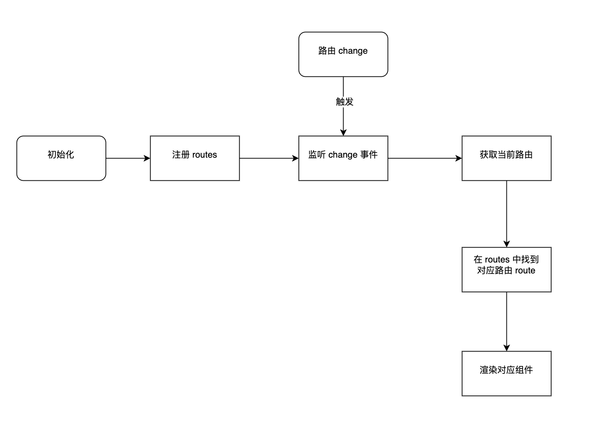

# 前言

前端路由，大家都使用过，那么有没有想过它是怎么实现的吗？如：Vue-Router 或者 React-Router。或许有个大概印象，但是真正要自己去实现还是没有什么思路，那么这篇文章将完整的实现思路去实现一次。

手写难度：⭐️⭐️⭐️

涉及知识点：

- history api 和监听事件
- onhashchange 监听事件
- Web Component 自定义组件

<!-- more -->

# 路由管理

路由管理，是指的 web 应用在浏览器下根据不同的url地址展示不同的内容或者页面。

不管是 Vue-Router 或者  React-Router，基本上都是基于浏览器两种路由控制有一定了解，如下：

- hash，代表网页中的一个位置，通常用来做锚点使用，后面被用于单页web 应用的路由控制
- history，代表网页的历史记录，同时提供接口操作浏览器的曾经在标签页或者框架里访问的会话历史记录

下面我们对两个进行简单了解。

## Hash

> Hash，通常是指的浏览器 URL 地址中带#的值，如：`URL = https://baidu.com/#/page1`，那么 `URL.hash='#/page1'`

Hash 常用的 的几个方法：

**`hashchange`**

> 当 URL 的片段标识符更改时，将触发hashchange事件

```js
window.addEventListener('hashchange', function() {
  console.log('The hash has changed!')
}, false);
```

**`调整 hash`**

除了监听改变之外，我们还需要对Hash 自由调整，如：添加或者修改，代码如下：

```js
location.hash = '#/page2'
```

## History

> `History` 接口允许操作浏览器的曾经在标签页或者框架里访问的会话历史记录。

`History` 提供的 API 接口：

- `pushState(state, unused, url)`  按指定的名称和 URL（如果提供该参数）将数据 push 进会话历史栈  如：`history.pushState({page: 1}, "title 1", "?page=1")`
- `replaceState(state, unused, url)`  按指定的数据、名称和 URL（如果提供该参数），更新 history 栈上最新的条目 如：`history.replaceState({page: 3}, "title 3", "?page=3");`
- `back()` 转到浏览器会话历史的上一页 等价于 `history.go(-1)`
- `forward()` 转到浏览器会话历史的下一页 等价于 `history.go(1)`

还有一个比较重要的事件就是 `onpopstate`，用来监听浏览器的历史记录发生变化的。

# Router 实现

在了解完路由管理机制，接下来我们对  `Vue-Router`  和  `React-Router` 的功能实现做一个总结，一个基础的 `Router` 应该具备以下功能：

- 路由中心，负责注册、匹配、存储等功能
- `router-view` 和 `router-link`组件实现
- 跳转api

Router基本功能流程要点如下：




接下来我们就按照每个功能模块进行简单实现。

## 路由中心
路由中心功能分为两块，一是注册管理，二是监听匹配。

### 注册管理
注册管理，顾名思义就是将所有路由对应页面组件配置统一管理，当路由改变的时候，可以直接从配置找到对应页面组件。

```js
/**
 * 注册路由
 * @param {*} routes 
 * @param {*} mode 
 * @returns 
 */
function createRouter(routes, mode='history'){
    // 保存路由
    const matcherMap = new Map()
    for (let route of routes) {
        matcherMap.set(route.name, route)
    }

    // 添加路由
    function addRoutes(routes){
        for (let route of routes) {
            matcherMap.set(route.name, route)
        }
    }

    // 删除路由
    function removeRoutes(routes){
        for (let route of routes) {
            matcherMap.delete(route.name)
        }
    }

    // 获取路由
    function getRoutes(){
        return matcherMap
    }

    // 获取路由
    function getRoute(name){
        return matcherMap.get(name)
    }

    const router = {
        addRoutes,
        removeRoutes,
        getRoutes,
        getRoute
    }

    return router
}

```

### 路由匹配
这里我们就简单实现一下，将 `path`作为 map 的 key 去存储，忽略一下比较复杂的情况，如： query 中 params和  `/path/:id`等情况

因此我们只需要通过获取 `matcherMap` 对象中对应的组件即可。

## 组件
组件渲染，其实在 Vue 或者 React 中都有对应渲染组件的方法，这里为了更简单实现例子，我们使用了`Web Component`规范去实现自定义组件`<router-view>`展示和渲染组件。

分为两个功能点：

1. 自定义组件`<router-view>`
2. 匹配到路由组件后渲染对应组件

### `<router-view>`组件实现
这里使用 WebCompoent 去实现，代码如下：
```js
// 自定义路由组件
customElements.define('router-view', class extends HTMLElement {
    constructor() {
        super();
        const template = document.createElement('template');
        template.id = 'router-view';
        template.innerHTML = '<div><slot name="content"></slot></div>';
        const templateContent = template.content;

        const shadowRoot = this.attachShadow({ mode: "open" });
        shadowRoot.appendChild(templateContent.cloneNode(true));
    }
});
```

### 渲染对应组件
当监听到
```js
// 路由回调
function callback() {
    const route = match(window.location)
    if (currentRoute && currentRoute.path === route.path) {
        return
    }
    if (!route) {
        // 路由不存在，跳转到首页
        push('/')
        return
    }
    if (route) {
        currentRoute = route
        const component = route.component
        // 渲染组件
        document.querySelector('router-view').innerHTML = `<${component} slot="content"></${component}>`
    }
}
```

完整代码我放到 github 上，大家感兴趣可以去看看[Github Router完整实现](https://github.com/qiubohong/hundred-interview-questions/blob/main/5-router-component)

[Demo体验可以看这里](https://qborfy.com/code/face/router/index.html#/)

# 额外知识点

## WebComponent

> Web Component 是一套不同的技术，允许你创建可重用的定制元素（它们的功能封装在你的代码之外）并且在你的 web 应用中使用它们。 —— [Web Component](https://developer.mozilla.org/zh-CN/docs/Web/API/Web_components)

简单的理解，就是浏览器可以允许你自定义HTML 标签，且包含自定义的 CSS 样式和 JS 脚本逻辑。里面有三个点学习：

- Custom element（自定义元素），通过 JS 可以自定义 HTML 标签
- Shadow DOM（影子 DOM），可以将HTML DOM 树以附加 Shadow DOM到自定义 HTMl 标签中，从而不影响原本 HTML DOM 树结构
- HTML template（HTML 模板），支持<template> 和 <slot> 元素，使您可以编写不在呈现页面中显示的标记模板。然后它们可以作为自定义元素结构的基础被多次重用

### 实践例子

1. 自定义HTML 标签代码如下：

```js
class CustomHTMl extends HTMLElement{
    constructor(){
        // 必须首先调用 super 方法
        super();

        // 创建一个 shadow root
        const shadow = this.attachShadow({mode: 'open'});

        // 创建一个 spans
        const wrapper = document.createElement('h1');
        wrapper.innerHTML = '测试自定义元素';

        shadow.appendChild(wrapper);
    }

    // 首次被插入到文档 DOM 节点上时被调用
    connectedCallback() {
        console.log('首次被插入到文档 DOM 节点上时被调用');
    }
    // 当 custom element 从文档 DOM 中删除时，被调用
    disconnectedCallback() {
        console.log('当 custom element 从文档 DOM 中删除时，被调用');
    }
    // 当 custom element 被移动到新的文档时，被调用
    adoptedCallback() {
        console.log('当 custom element 被移动到新的文档时，被调用');
    }
    // 增加、删除或者修改某个属性时被调用
    attributeChangedCallback(name, oldValue, newValue) {
        console.log('增加、删除或者修改某个属性时被调用');
    }

}
// 注册组件标签，这里比较重要
customElements.define('custom-html', PopUpInfo);
```

实际应用如下：
```html
<body>
    <!-- 这里就会展示h1 -->
    <custom-html></custom-html>
</body>
```

2. 使用 `template`模板 + `slot`插槽
```html
<body>
    <!-- 使用模板 -->    
    <template id="template">
        <!-- slot 通过 name 确定放在哪里 -->
        <h1><slot name="title"></slot></h1>
        <p>
            <slot name="content"></slot>
        </p>
    </template>
    <!-- 自定义标签使用示范 -->
    <article-page>
        <!-- slot 标识使用哪个插槽 -->
        <span slot="title">这是标题</span>
        <span slot="content">这是内容</span>
    </article-page>

    <script>
        class Article extends HTMLElement{
            constructor(){
                super();
                const template = document.getElementById('template');
                const templateContent = template.content;
                const shadowRoot = this.attachShadow({mode: 'open'}).appendChild(templateContent.cloneNode(true));
            }
        }
        customElements.define('article-page', Article);
    </script>
</body>

```

# 参考资料

- [MDN History资料](https://developer.mozilla.org/zh-CN/docs/Web/API/History)
- [Web Component 自定义组件](https://developer.mozilla.org/zh-CN/docs/Web/API/Web_components)